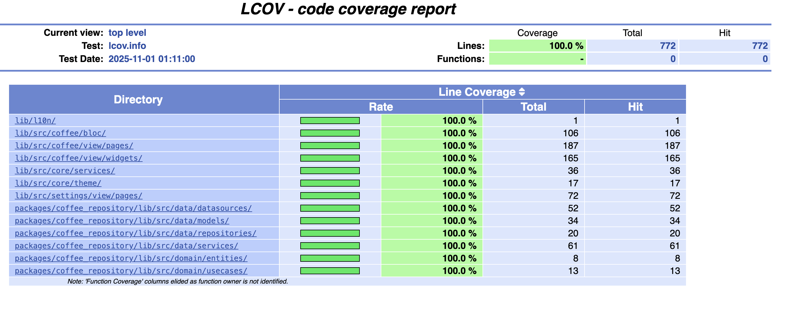

# Coffee App

![coverage][coverage_badge]
[![style: very good analysis][very_good_analysis_badge]][very_good_analysis_link]
[![License: MIT][license_badge]][license_link]

Generated by the [Very Good CLI][very_good_cli_link] 🤖

A beautiful Flutter app that lets you discover and favorite coffee images from around the world. Built with clean architecture following Very Good Ventures' best practices.

## Demo 🎬

<div align="center">
  
  
</div>

---

## Features ☕

- **Random Coffee Discovery**: Load beautiful coffee images from the [Coffee API](https://coffee.alexflipnote.dev)
- **Favorites System**: Save your favorite coffee images for offline viewing with local caching
- **Coffee Roast Themes**: Three beautiful themes inspired by coffee roasts (Light, Medium, Dark) with roast-specific color palettes
- **Animated Image Zoom**: Double-tap to zoom with smooth animations, pinch-to-zoom (1x-4x scale)
- **Bottom Navigation**: Consistent navigation across all pages (Home, Favorites, Settings)
- **Design System**: Comprehensive design system with centralized colors, typography, and spacing
- **Internationalization**: Full i18n support with English and Portuguese translations
- **Material Design 3**: Modern UI following Material Design 3 guidelines
- **Local Storage**: All favorites stored locally using SharedPreferences with image caching
- **Error Handling**: Graceful error states with retry functionality
- **Loading States**: Smooth loading indicators for better UX
- **Cross-Platform**: Native support for iOS and Android
- **Clean Architecture**: 4-layer VGV architecture (Data, Repository, Business Logic, Presentation)

## Test Coverage 🎯



This project maintains **100% code coverage** across all source files:
- ✅ **249 tests** covering all business logic
- ✅ **772/772 lines** covered with zero exclusions
- ✅ All layers tested: Data, Domain, Business Logic, and Presentation

---

## Architecture 🏗️

This app follows Very Good Ventures' 4-layer architecture:

### 📊 Data Layer
- **Remote DataSource**: Handles API communication with the coffee service
- **Local DataSource**: Manages local storage of favorite coffees
- **Models**: Data transfer objects with JSON serialization

### 🔄 Repository Layer
- **Repository Implementation**: Combines data sources and implements business rules
- **Repository Interface**: Abstract contract for data operations

### 🧠 Business Logic Layer
- **Use Cases**: Specific business operations (get random coffee, manage favorites)
- **Entities**: Core business objects
- **BLoC**: State management using flutter_bloc pattern

### 🎨 Presentation Layer
- **Pages**: Screen-level widgets
- **Widgets**: Reusable UI components
- **BLoC Events/States**: UI state management

---

## Getting Started 🚀

### Prerequisites

- Flutter SDK (>= 3.24.0)
- Dart SDK (^3.5.0)
- Xcode (for iOS development)
- Android Studio (for Android development)

### Installation

1. Clone the repository:
```sh
git clone <repository-url>
cd coffee_app
```

2. Install dependencies:
```sh
flutter pub get
```

3. Generate code:
```sh
dart run build_runner build --delete-conflicting-outputs
```

### Running the App

This project contains 3 flavors:

- development
- staging
- production

To run the desired flavor either use the launch configuration in VSCode/Android Studio or use the following commands:

```sh
# Development
$ flutter run --flavor development --target lib/main_development.dart

# Staging
$ flutter run --flavor staging --target lib/main_staging.dart

# Production
$ flutter run --flavor production --target lib/main_production.dart
```

_\*Coffee App works on iOS and Android._

---

## Running Tests & Coverage 🧪

### Test Structure

The project has tests in two locations:
- **Main app tests**: `/test/` (162 tests) - UI, BLoC, and integration tests
- **Package tests**: `/packages/coffee_repository/test/` (87 tests) - Repository layer tests

**Total: 249 tests**

### Running All Tests

To run all tests, execute both commands:

```sh
# Test main app (162 tests)
flutter test

# Test coffee_repository package (87 tests)
cd packages/coffee_repository && flutter test && cd ../..
```

### Coverage Report

**Option 1: Combined Coverage Report (Recommended)**

Merge coverage from both main app and package into one report:

```sh
# Run tests for main app
very_good test --coverage --test-randomize-ordering-seed random

# Run tests for package
cd packages/coffee_repository && flutter test --coverage && cd ../..

# Adjust package paths to be relative to project root
sed 's|SF:lib/|SF:packages/coffee_repository/lib/|g' packages/coffee_repository/coverage/lcov.info > packages/coffee_repository/coverage/lcov_adjusted.info

# Merge coverage files
lcov --add-tracefile coverage/lcov.info \
     --add-tracefile packages/coffee_repository/coverage/lcov_adjusted.info \
     --output-file coverage/merged.info

# Filter out generated files
lcov --remove coverage/merged.info "**/l10n/generated/**" --ignore-errors unused --output-file coverage/lcov.info

# Generate HTML report (all paths now relative to project root)
genhtml coverage/lcov.info -o coverage --prefix "$PWD"

# Open in browser
open coverage/index.html
```

**Option 2: Separate Coverage Reports**

For main app coverage only:

```sh
# Main app coverage
very_good test --coverage --test-randomize-ordering-seed random
lcov --remove coverage/lcov.info "**/l10n/generated/**" --ignore-errors unused --output-file coverage/lcov.filtered && mv coverage/lcov.filtered coverage/lcov.info
genhtml ./coverage/lcov.info -o coverage
open coverage/index.html
```

For package coverage only:

```sh
# Package coverage
cd packages/coffee_repository
flutter test --coverage
genhtml ./coverage/lcov.info -o coverage
open coverage/index.html
```

Coverage reports exclude generated localization files (`**/l10n/generated/**`) as specified in `analysis_options.yaml`.

### CI/CD Testing

When pushing to GitHub, the CI/CD pipeline will automatically:
- Run tests with coverage
- Apply the same exclusions as local testing
- Enforce minimum coverage thresholds
- Generate coverage reports

See `.github/workflows/test.yml` for the complete CI/CD configuration.

## API Integration 🌐

The app integrates with the [Coffee API](https://coffee.alexflipnote.dev) to fetch random coffee images:

- **Endpoint**: `https://coffee.alexflipnote.dev/random.json`
- **Response Format**:
```json
{
  "id": "unique-coffee-id",
  "file": "https://coffee-image-url.jpg"
}
```

---

## Dependencies 📦

### Core Dependencies
- `flutter_bloc`: State management
- `get_it`: Dependency injection
- `http`: HTTP client for API calls
- `shared_preferences`: Local storage
- `path_provider`: File system paths
- `google_fonts`: Custom fonts (Poppins)
- `equatable`: Value equality
- `json_annotation`: JSON serialization
- `flutter_localizations`: Internationalization support

### Development Dependencies
- `very_good_analysis`: Linting rules
- `build_runner`: Code generation
- `json_serializable`: JSON serialization codegen
- `mocktail`: Testing framework
- `bloc_test`: BLoC testing utilities

---

## Design System 🎨

The app implements a comprehensive design system located in `lib/src/core/design_system/`:

### Components

- **AppColors**: Centralized color palette with coffee-themed colors, semantic colors, and grey scale
- **AppTextStyles**: Material Design 3 compliant typography with app-specific styles
- **AppSpacing**: Consistent spacing values, padding, margins, and sizing constants
- **AppTheme**: Three coffee roast-inspired themes with Material Design 3 support

### Coffee Roast Themes ☕☕☕

The app features three beautiful themes inspired by coffee roasts:

1. **Light Roast** ☕ - Bright and vibrant with warm amber tones
   - Primary: Amber/Gold palette
   - Perfect for morning coffee lovers
   
2. **Medium Roast** ☕☕ - Balanced and rich with brown tones
   - Primary: Coffee brown palette
   - The classic coffee experience
   
3. **Dark Roast** ☕☕☕ - Bold and intense with deep espresso colors
   - Primary: Deep brown/black palette
   - For those who like it strong

Each theme includes roast-specific color palettes that adapt the entire app UI. Switch themes in the Settings page!

### Usage

```dart
// Colors
Container(color: AppColors.primary)

// Text Styles
Text('Title', style: AppTextStyles.pageTitle)

// Spacing
Padding(padding: AppSpacing.paddingAllMedium)
SizedBox(height: AppSpacing.md)

// Theme
MaterialApp(theme: AppTheme.light)
```

All UI components use the design system - no hardcoded colors, sizes, or text styles!

---

## Working with Translations 🌐

This project relies on [flutter_localizations][flutter_localizations_link] and follows the [official internationalization guide for Flutter][internationalization_link].

### Adding Strings

1. To add a new localizable string, open the `app_en.arb` file at `lib/l10n/arb/app_en.arb`.

```arb
{
    "@@locale": "en",
    "coffeeAppBarTitle": "Coffee App",
    "@coffeeAppBarTitle": {
        "description": "Text shown in the AppBar of the Coffee App"
    }
}
```

### Adding Supported Locales

Update the `CFBundleLocalizations` array in the `Info.plist` at `ios/Runner/Info.plist` to include the new locale.

```xml
    ...
    <key>CFBundleLocalizations</key>
	<array>
		<string>en</string>
		<string>es</string>
	</array>
    ...
```

### Generating Translations

To use the latest translations changes, you will need to generate them:

```sh
flutter gen-l10n --arb-dir="lib/l10n/arb"
```

---

## Contributing 🤝

1. Fork the repository
2. Create your feature branch (`git checkout -b feature/amazing-feature`)
3. Commit your changes (`git commit -m 'Add some amazing feature'`)
4. Push to the branch (`git push origin feature/amazing-feature`)
5. Open a Pull Request

---

## License 📄

This project is licensed under the MIT License - see the [LICENSE](LICENSE) file for details.

---

## Acknowledgments 🙏

- [Very Good Ventures](https://verygood.ventures/) for the amazing CLI and architecture patterns
- [Coffee API](https://coffee.alexflipnote.dev) for providing beautiful coffee images
- Flutter community for the excellent tools and libraries

[coverage_badge]: coverage_badge.svg
[flutter_localizations_link]: https://api.flutter.dev/flutter/flutter_localizations/flutter_localizations-library.html
[internationalization_link]: https://flutter.dev/docs/development/accessibility-and-localization/internationalization
[license_badge]: https://img.shields.io/badge/license-MIT-blue.svg
[license_link]: https://opensource.org/licenses/MIT
[very_good_analysis_badge]: https://img.shields.io/badge/style-very_good_analysis-B22C89.svg
[very_good_analysis_link]: https://pub.dev/packages/very_good_analysis
[very_good_cli_link]: https://github.com/VeryGoodOpenSource/very_good_cli
